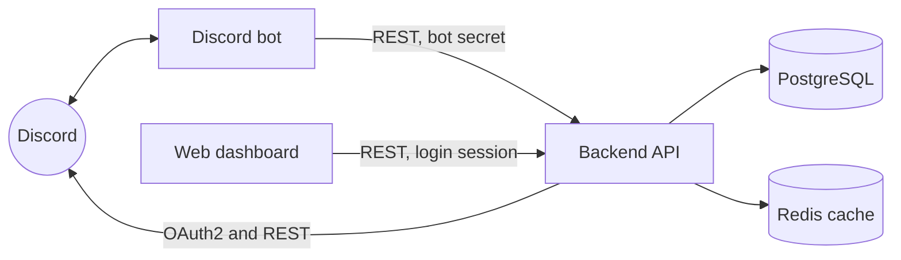

# Loki

**Loki is a Discord bot for community servers that brings moderation tools and fun commands together in one place, all managed from a web dashboard.** Instead of inviting several single-purpose bots whose features overlap, a server can run one bot that handles both keeping the peace and keeping things fun.

> **Status: Alpha.** Loki is in active development and isn't publicly deployed yet. An earlier version runs in a private community server, where `/throw` became a favourite and shaped this rewrite.

<!--
  Screenshots: add the two image files at these paths, then delete this comment's opening and closing lines.
<p align="center">
  
  
</p>
-->

## Features

### Moderation

- **Slash commands for every common action:** `/warn`, `/kick`, `/ban` and `/unban`, `/mute` and `/unmute`, `/timeout` and `/remove-timeout`.
- **Temporary actions that end on their own.** Bans, mutes and timeouts can be given a length in plain language (`2 hours`, `1 week`, `1d12h`), with autocomplete that previews how it was understood. They're lifted automatically when they expire, including ones that expired while the bot was offline.
- **Members are told why.** Warnings, kicks, bans, mutes and timeouts send the member a DM with the reason and, where relevant, how long it lasts. Members are also told when a mute or timeout is lifted early, or when a mute runs out. These messages never name the moderator who acted.
- **Rules set per server.** Each action can be turned on or off, can require a reason or evidence, and has a default duration where it applies.
- **Safety checks.** Every command checks the moderator's Discord permissions, and the bot's own, before acting. To warn, kick, ban, mute or time out a member, the moderator also has to outrank them.
- **An audit trail.** Every moderation action, and every later change to one, is recorded with who did it and why. Changing an existing action's reason or evidence requires a reason for the change.

### Fun

- **`/throw`:** members throw things at each other, with four weighted outcomes: one item, two at once, three at once, or a throw that bounces onto someone else.
- **Built-in content:** 42 items and 24 message templates (6 per outcome) live in a single data file, so they're easy to extend.
- **Configurable per server:** custom items (added to the built-in list, or replacing it once a server has 20 or more), a per-member cooldown, a channel whitelist or blacklist, and opt-in roles that decide who a bounced throw can land on.

### Web dashboard

- **Log in with Discord** and see the servers you have access to. For servers you own or manage that don't have the bot yet, there's an "Add to Server" link.
- **Access tiers that follow your server's roles:**
  - **manage:** anyone with the Manage Server permission. Full access, including deciding who else has access.
  - **edit:** roles the server chooses. Can change settings.
  - **view:** roles the server chooses. Can see settings, read-only.

  Access is enforced by the API on every request; the dashboard only reflects it.
- **Settings pages** for `/throw`, for each moderation action (one tab per action), and for dashboard access. Unsaved changes trigger a warning before you leave the page.

## Architecture



Loki is a monorepo with three apps.

- **The backend API** is the only part that touches the database. It validates every request, enforces dashboard access, caches Discord lookups (such as a server's roles and channels) in Redis, and stores users' Discord OAuth tokens encrypted at rest (AES-256-GCM).
- **The Discord bot** never reads or writes the database directly. It gets server settings from the API and records moderation actions through it. It also polls the API once a minute for temporary actions that have expired, and lifts them.
- **The web dashboard** is a client of the same API, so the bot and the dashboard always see the same settings.

The bot runs on a small **custom command framework** that replaced CommandKit. Commands and event handlers are plain files that are discovered automatically, slash commands are synced with Discord on startup, and a developer-only `/reload-commands` command reloads command files without restarting the bot.

```
apps/
  Discord Bot/   the bot (discord.js)
  backend/       the API (Express)
  web/           the dashboard and website (Next.js)
packages/        shared ESLint and TypeScript configs, and a UI package
```

## Tech stack

| Area | Technologies |
|---|---|
| Language | TypeScript |
| Discord bot | discord.js, custom command framework, Zod |
| Backend API | Express, TypeORM, PostgreSQL, Redis, Zod |
| Web dashboard | Next.js, React, Tailwind CSS, SWR |
| Monorepo | Turborepo, pnpm workspaces |

## Local setup

### Prerequisites

- **Node.js** and **pnpm 10** (the repo pins `pnpm@10.26.1`).
- **PostgreSQL:** an empty database for Loki. Outside production, the schema is created and updated automatically when the backend starts.
- **Redis**, with a password set. The backend connects as the `default` user, and won't start without Redis.
- **A Discord application** from the [Discord Developer Portal](https://discord.com/developers/applications):
  - **Bot tab:** a bot token, and the **Server Members** and **Message Content** privileged intents switched on. The bot requests both.
  - **OAuth2 tab:** add `http://localhost:4000/auth/callback` as a redirect URI. Dashboard login asks for the `identify`, `guilds` and `guilds.members.read` scopes.
  - **From General Information and OAuth2:** note the application's client ID and client secret.

### Environment variables

Each app reads a `.env` file in its own folder. The backend and bot validate theirs at startup, and refuse to start with a list of anything missing or invalid.

**`apps/backend/.env`**

| Variable | Required | Notes |
|---|---|---|
| `DATABASE_URL` | yes | PostgreSQL connection string |
| `REDIS_HOST`, `REDIS_PORT`, `REDIS_PASSWORD` | yes | |
| `SESSION_SECRET` | yes | Any long random string |
| `TOKEN_ENCRYPTION_KEY` | yes | 32 random bytes, base64. Generate with `node -e "console.log(require('crypto').randomBytes(32).toString('base64'))"` |
| `DISCORD_CLIENT_ID`, `DISCORD_CLIENT_SECRET` | yes | From the Discord application |
| `BOT_TOKEN` | yes | The bot's token (the backend also calls Discord as the bot) |
| `BOT_API_SECRET` | yes | A shared secret; must match the bot's |
| `FRONTEND_ORIGIN` | yes | e.g. `http://localhost:3000` |
| `BACKEND_ORIGIN` | yes | e.g. `http://localhost:4000` |
| `DISCORD_REDIRECT_URI` | no | Defaults to `http://localhost:4000/auth/callback` |
| `PORT` | no | Defaults to `4000` |
| `NODE_ENV` | no | Defaults to `development` |
| `TRUST_PROXY` | no | Number of reverse proxies in front of the backend; defaults to `0` |
| `DB_RESET` | no | `true` drops the whole database on every start. Development only; refused when `NODE_ENV=production` |

**`apps/Discord Bot/.env`**

| Variable | Required | Notes |
|---|---|---|
| `BOT_TOKEN` | yes | The bot's token |
| `BOT_API_SECRET` | yes | Must match the backend's |
| `BACKEND_URL` | no | Defaults to `http://localhost:4000` |
| `DEV_GUILD_ID` | no | A private test server, where developer-only commands like `/reload-commands` are registered |
| `LOG_CHANNEL_ID` | no | Channel for "joined a new server" notices |
| `CRITICAL_ERROR_CHANNEL_ID` | no | Channel for critical error reports |
| `LOG_LEVEL` | no | `debug`, `info`, `warn` or `error`; defaults to `info` |

**`apps/web/.env.local`**

| Variable | Required | Notes |
|---|---|---|
| `NEXT_PUBLIC_API_URL` | no | The backend's URL; defaults to `http://localhost:4000` |
| `NEXT_PUBLIC_DISCORD_CLIENT_ID` | for invites | The application ID, used to build "Add to Discord" links |
| `NEXT_PUBLIC_POSTHOG_KEY`, `NEXT_PUBLIC_POSTHOG_HOST` | no | PostHog analytics |

The backend, bot and web folders each include a `.env.example` to start from.

### Run it

```bash
pnpm install
pnpm dev
```

`pnpm dev` starts all three apps through Turborepo: the backend on `http://localhost:4000`, the dashboard on `http://localhost:3000`, and the bot. To build everything, use `pnpm build`.

## Roadmap

- [x] Custom command framework (replacing CommandKit)
- [x] `/throw` command
- [x] Moderation commands: warn, kick, ban/unban, mute/unmute, timeout/remove-timeout
- [x] Automatic expiry of temporary bans, mutes and timeouts
- [x] Audit trail for moderation actions
- [x] Web dashboard with Discord login and role-based access
- [x] Dashboard settings for `/throw`, moderation and dashboard access
- [ ] Server logging, including a moderation log channel
- [ ] Evidence locker channel for moderation evidence
- [ ] Custom notification messages per server
- [ ] Starboard
- [ ] Ticket system
- [ ] Automod
- [ ] Template-based custom commands
- [ ] Urban Dictionary command
- [ ] Public beta release
